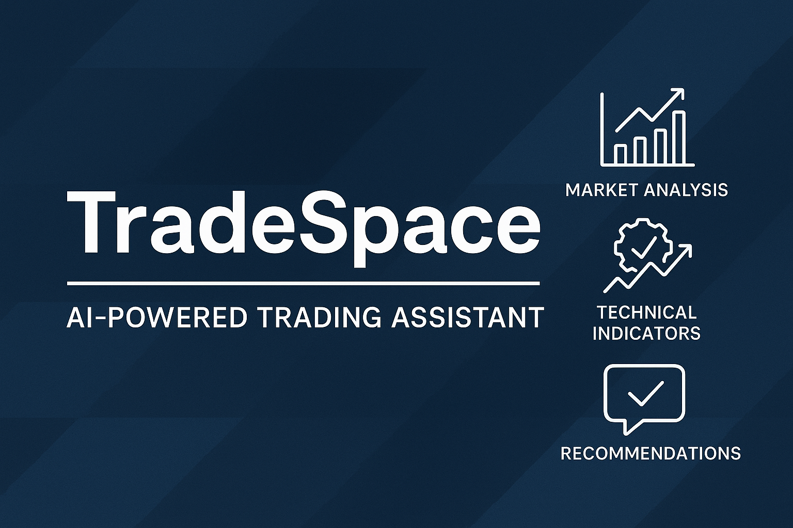

<p align="center">
  
</p>

# TradeSpace — AI-Powered Trading Assistant

**TradeSpace** is an MVP of an intelligent daily advisor for market analysis and decision-making.

## 🚀 Features

- Built with Python, Django and OpenAI API
- Supports trading strategies: ICT, SMC, SNR
- Technical indicators integration: RSI, MACD, VWAP, and more
- MetaTrader 5 data integration (via Python)
- Modular AI interface for recommendations
- Visual insights using Plotly
- Risk/reward calculators and session logic

## 📦 Stack

- Python 3.10+
- Django
- Bootstrap CSS
- Plotly
- OpenAI API
- MT5
- db.sqlite3

## ⚠️ Work in progress

This is a work-in-progress MVP. Please use carefully and contribute if you're interested!

## 🧠 License

MIT — use it, credit it, improve it.

###

## 🛠 Getting Started

### 1. Clone the repository

```bash
git clone https://github.com/AitemIntellex/TradeSpace-MVPPDO.git
cd TradeSpace-MVPPDO
```

1. Set up a virtual environment
   python -m venv .venv
   .venv\Scripts\Activate.ps1 # For PowerShell
   pip install -r requirements.txt
   -->
2. Set up TaLib
3. Configure your environment
   Create a .env file with your keys:

<!-- OPENAI_API_KEY=your_key_here -->

MT5_LOGIN=123456
MT5_PASSWORD=your_password
jango_secret_key = you django secret key
